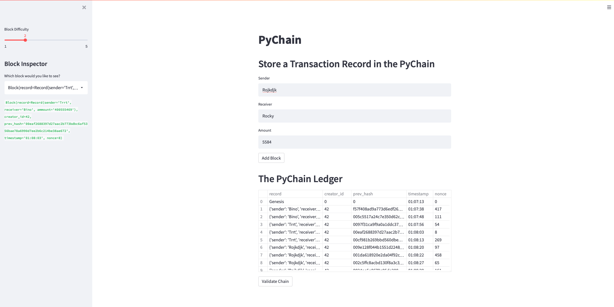

# Module_18_Challenge

## Financial Transaction BlockChain 

---
#### Description 
The goal of this project is to create a blockchain ledger that takes in user transaction data from a streamlit web appliaction, and places it in block that are valididated and uploadd to the chain. 

### Step 1 & 2 
Create a Record Data Class that stores information of the Sender, Receiver, and Amount transacted

Then change the attribute in the Block dataclass to incude the Record dataclass instead of "data"

### Step 3

Indlude input areas on the streamlit webpage that allows users to input Sender, Receiver, and Amount information using the st.text_input function 

Then update new_block function to include the sender, receivee, and ammpunt information from the Record dataclass

### Step 4 
Test the Financial Transaction Ledger by adding multiple block to the chain. Review the new chains created. 

Verify the Blockchain validation proceess is runnning successfully. 

